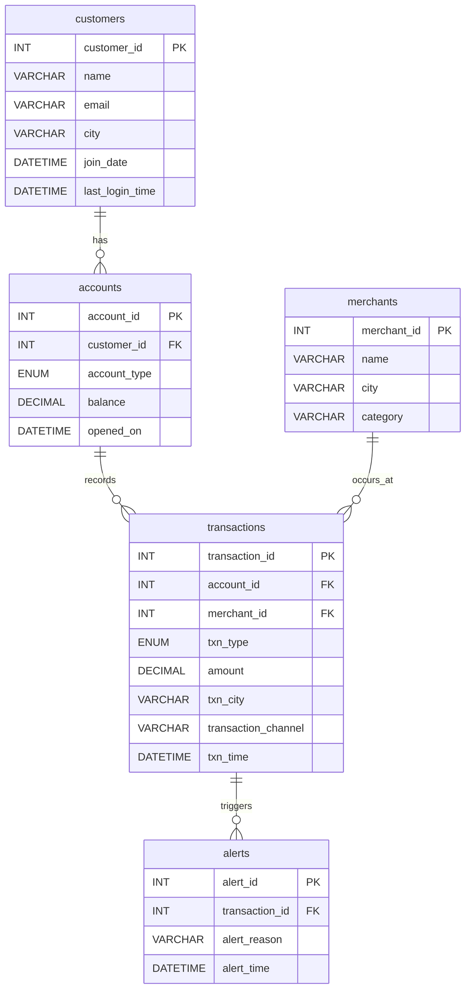

# ER Diagram (Mermaid)

```mermaid
erDiagram
    customers ||--o{ accounts : has
    accounts ||--o{ transactions : records
    merchants ||--o{ transactions : occurs_at
    transactions ||--o{ alerts : triggers

    customers {
        INT customer_id PK
        VARCHAR name
        VARCHAR email
        VARCHAR city
        DATETIME join_date
        DATETIME last_login_time
    }

    accounts {
        INT account_id PK
        INT customer_id FK
        ENUM account_type
        DECIMAL balance
        DATETIME opened_on
    }

    merchants {
        INT merchant_id PK
        VARCHAR name
        VARCHAR city
        VARCHAR category
    }

    transactions {
        INT transaction_id PK
        INT account_id FK
        INT merchant_id FK
        ENUM txn_type
        DECIMAL amount
        VARCHAR txn_city
        VARCHAR transaction_channel
        DATETIME txn_time
    }

    alerts {
        INT alert_id PK
        INT transaction_id FK
        VARCHAR alert_reason
        DATETIME alert_time
    }
```
